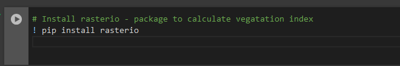
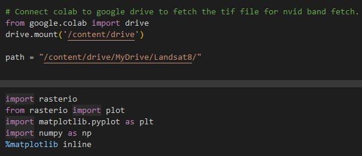
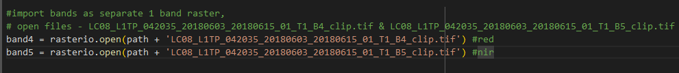
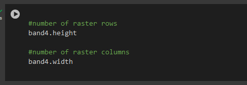
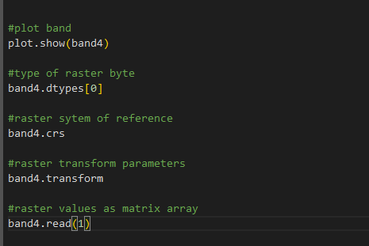
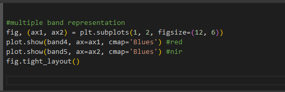
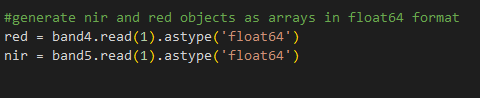
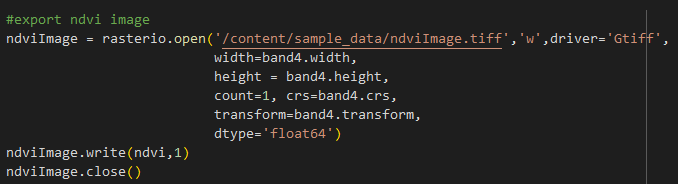
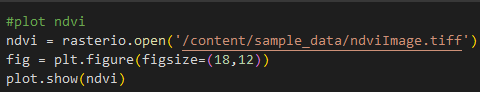

 

# Notebook - Nvid

- Add the code from the given reference and run the cell.

- If the code already exists, please run the code and move to the next cell.

## Install rasterio which is used for NVID Calculation

## Run cell 2, 3, 4

## Open the files for band fetch, media/Landsat8 folder, upload to google drive in 'Landsat8' folder

## Check band4 height and width

## Visualize the band4 region using plot

## Visualize the multiple band 

 
## Calculate the ndvi using bands fetched from tif

## Save the tiff file with crs data

## Display saved the tiff file

