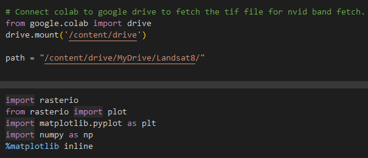
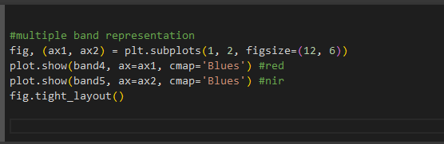
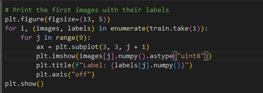
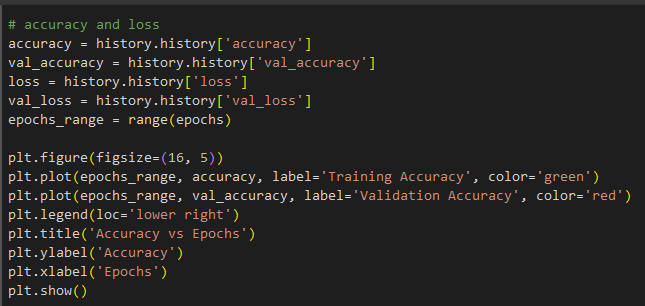

# Workshop for Nvid & Satellite Image Classification

Prerequisites for the workshop

- Clone this repo to google colab, we will working in google colab in this workshop

- Open and  start working on the copyFiles2YourDrive.ipynb to copy satellite Images to your google drive for exercise

# Notebook - Nvid

- Add the code from the given reference and run the cell.

- If the code already exists, please run the code and move to the next cell.

## Install rasterio which is used for NVID Calculation

## Run cell 2, 3, 4

## Open the files for band fetch

# Check band4 height and width

#Visualize the band4 region using plot

# Visualize the multiple band 

Plot the same in the crs band.

# Satelite Data Image Classification - Deep Learning

- Open and  start working on the satelliteImageClassification.ipynb to identify Cloud, Desert, Water, GreenArea

## Run the import and drive import cell

## Load dataset and split into training and validation sets

# Display the first few images in training Dataset

# Display the first few images in validation Dataset

## Print the number of land areas available for classification

# Name those classes

# Define the CNN with layers needed for Classification training

## Compile the Model

## Fit the model

## Display Summary

## Run the below cells to find the prediction accuracy

## Predict one Image from the validation Dataset

