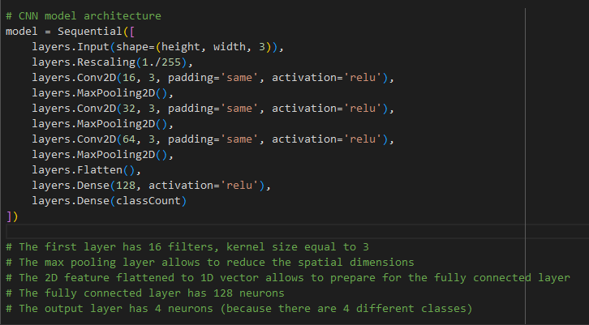

# Satelite Data Image Classification - Deep Learning

- In Colab, open this repo and start working on the satelliteImageClassification.ipynb to identify Cloud, Desert, Water, GreenArea

## Run the import and drive import cell

## Load dataset and split into training and validation sets

## Run the cell to display the first few images in training Dataset

## Run the cell to display the first few images in validation Dataset

## Print the number of land areas available for classification

## Run the cell to name those classes

## Define the CNN with layers needed for Classification training

## Compile the Model

## Fit the model

## Display Summary

## Run the below cells to find the prediction accuracy

## Predict one Image from the validation Dataset

